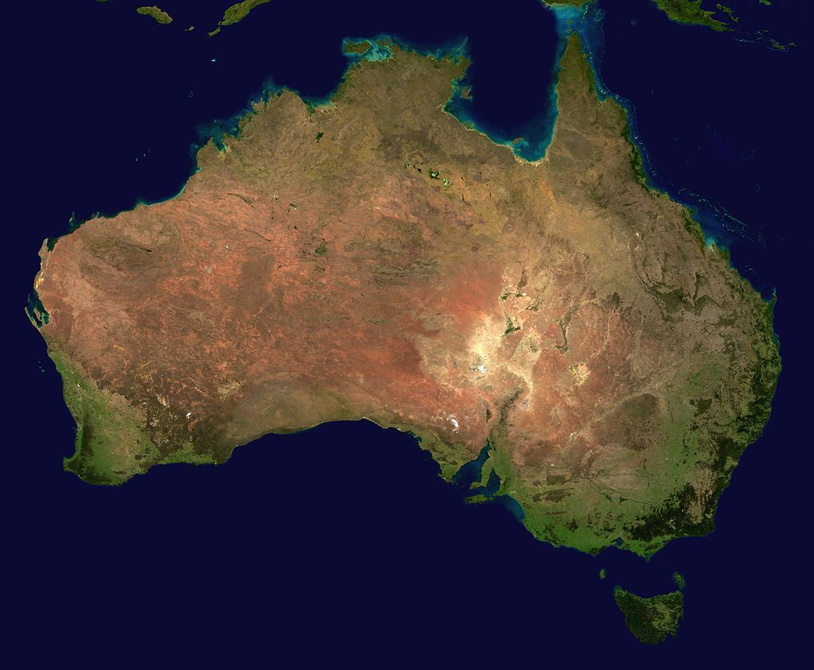

    

        
<strong>Australia</strong>, officially the <strong>Commonwealth o Australia</strong>, is a sovereign country comprising the mainland of the Australian continent, the island of Tasmania, and numerous smaller islands.

    

    

        
    

| FILE MANAGEMENT  |              |
| ---------------- | ------------ |
| `Ctrl+N`         | New File     |
| `Ctrl+O`         | Open File... |
| `Ctrl+S`         | Save         |
| `Ctrl+Shift+S`   | Save As...   |
| `Ctrl+W`         | Close        |
| `Ctrl+K  Ctrl+W` | Close All    |
{: class="table"}
    